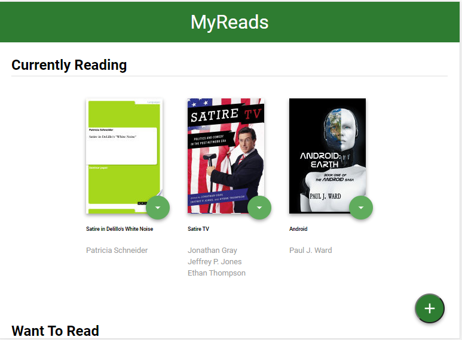
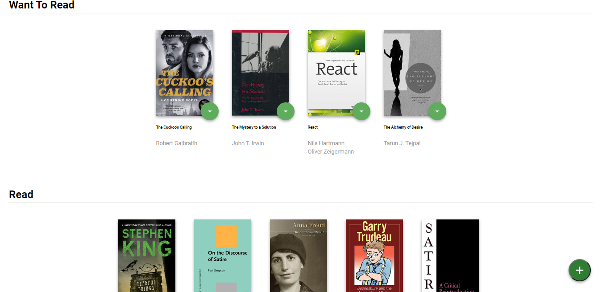
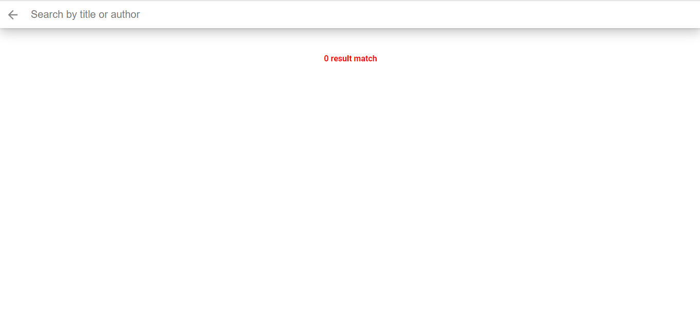
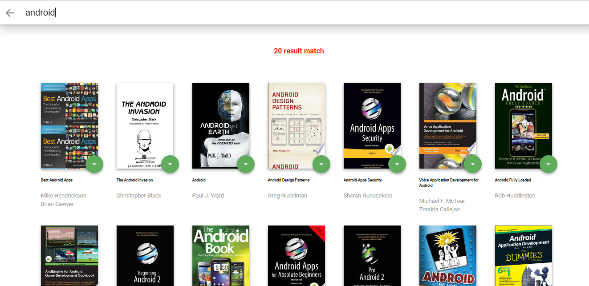

# MyReads Project
 This app is the first of three projects required for  Udacity's React Nanodegree program 
 It also allow you to search for books based on title and author.

MyReads is a simple cataloging app that allows you to place books in one of three shelves or categories.

- Currently Reading
- Want to Read
- Read

## Installation

* install project with `npm install`
* run with `npm start`

 
 

## Screenshots
<h1 >Home Page</h1>

       
       

 
<h1 >Search page</h1>

       
       

 
